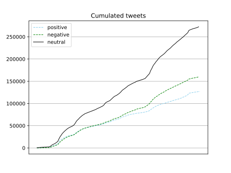

# SentimentAnalysisGreenpass

In this project we perform a text mining analysis about the Green pass.

Twitter has been exploited by people to express their opinions supporting or opposing measures taken by different governments against the pandemic. 
One of the most discussed topics was and is the introduction of the green pass. Hence we retrieved tweets related to this topic in order to understand what people in Italy think about the green pass

It can be noticed that the curve increases drastically in correspondence of the various peaks that we have analyzed.

The results are in line with we expected since we noticed that, from tweets, a higher number of people expressed a negative opinion about greenpass with respect to those expressing a positive one.

